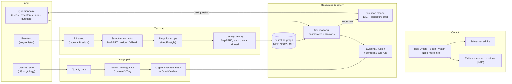
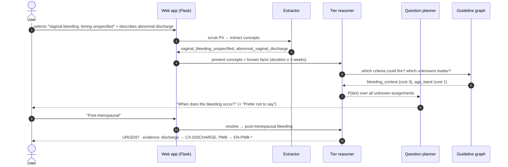

<div align="center">

# RareCare

### Stigma-robust, guideline-grounded triage for women's cancers

**BioBERT for symptoms · ConvNeXt on MedMNIST+ for scans · conformal guarantees · minimal-disclosure questioning**


</div>

> **Research prototype. Not a medical device and not a diagnosis.** RareCare helps people decide *how soon* to see a clinician. It does not tell them whether they have cancer.

---

## Table of contents

1. [Why RareCare exists](#1-why-rarecare-exists)
2. [What makes it different](#2-what-makes-it-different)
3. [System architecture](#3-system-architecture)
4. [How a decision is made](#4-how-a-decision-is-made)
5. [Components](#5-components)
6. [Datasets](#6-datasets)
7. [Models](#7-models)
8. [Evaluation plan](#8-evaluation-plan)
9. [Project status & results](#9-project-status--results)
10. [Quick start](#10-quick-start)
11. [API](#11-api)
12. [Training](#12-training)
13. [Repository layout](#13-repository-layout)
14. [Privacy, safety & limitations](#14-privacy-safety--limitations)
15. [Roadmap](#15-roadmap)

---

## 1. Why RareCare exists

For **breast, cervical and ovarian cancer**, the main bottleneck in low-resource settings is **delayed disclosure**, not classifier accuracy. Symptoms are frequently under-reported, described in non-clinical language, or normalised:

| Cancer | Why it presents late | Key symptoms (clinical terms) |
|---|---|---|
| **Breast** | Stigma and fear of the consequences of a diagnosis | Breast lump, nipple discharge or retraction, skin dimpling |
| **Cervical** | Under-reporting of gynaecological symptoms | Post-coital or intermenstrual bleeding, abnormal vaginal discharge |
| **Ovarian** | Non-specific symptoms that are easily normalised | Persistent abdominal distension, early satiety, pelvic pain |

Existing tools assume clinical vocabulary, give uncalibrated answers with no bound on missed cases, and ask personal questions up front. For this population, **those are the failure points**.

## 2. What makes it different

| Existing systems typically… | Limitation | RareCare instead… |
|---|---|---|
| Map *clinical* symptom terms to diagnoses (symptom checkers) | Fail on non-clinical or code-mixed language | Aligns **lay and code-mixed descriptions → clinical concepts** and measures the *lay-language gap* on a dedicated benchmark (**StigmaSymp-W**) |
| Report AUROC / accuracy | No bound on **missed urgent cases**, the costly error in screening | **Class-conditional conformal prediction**: miss rate on the urgent class ≤ α, per subgroup |
| Need all modalities, or fuse them naively | No paired text + image data exists for these cancers | **Evidential (subjective-logic) fusion** where a missing modality is a vacuous opinion, plus a **conformal OR-rule** that keeps each modality's guarantee without paired calibration data |
| Always answer | Confident output on out-of-distribution scans and vague text | **Abstains or asks**: quality gate, modality router with *unsupported-medical* and *non-medical* classes, energy-based OOD, and a *Need more info* tier |
| Ask a fixed questionnaire | Personal questions whether needed or not | **Picks each question by expected information gain ÷ disclosure cost**, with *"Prefer not to say"* always available |
| Let an LLM decide | Unauditable, uncalibrated | **Deterministic guideline-graph decision path**. Every result traces *your words → concept → NICE criterion → tier* |

**Research contributions (in progress)**

| | Contribution | Anchored on | Target venue |
|---|---|---|---|
| **A** | StigmaSymp-W benchmark and lay-language-gap analysis of biomedical encoders | Cervical, ovarian | BioNLP / ClinicalNLP |
| **B** | Conformal evidential fusion with missing modalities and subgroup guarantees | Breast (paired BrEaST data) | ML4H / CHIL / MICCAI UNSURE |
| **C** | Disclosure-cost-aware adaptive questioning | Cervical, ovarian | ML4H / CHI health |

## 3. System architecture



## 4. How a decision is made



**Decision rule.** The reasoner enumerates every assignment of the unknown variables that could change the outcome (age band, persistence, laterality, bleeding timing), weighted by priors, to get a distribution over tiers:

- If the most likely tier has probability ≥ 0.9, it **decides**.
- Otherwise it **asks** the question with the best `EIG / cost` ratio.
- If questions run out or are declined, it **escalates conservatively**: the most severe tier with probability ≥ 0.1. It never downgrades silently.

## 5. Components

| Layer | Module | What it does | Runs today |
|---|---|---|---|
| Guideline graph | `rarecare/kg/` | 13 NICE NG12 / CKS criteria, 18 concepts, lay and code-mixed lexicon, NetworkX graph with validation | ✅ |
| Text | `rarecare/text/` | PII scrub, normalisation, age/duration parsing, lexicon extractor with clause-scoped negation; BioBERT & SapBERT wrappers | ✅ rule path · 🔄 neural under training |
| Reasoning | `rarecare/agent/reasoner.py` | Exact tier distribution over unknowns; cost-aware EIG question planner; conservative escalation | ✅ |
| Uncertainty | `rarecare/uncertainty/` | Dirichlet opinions + reduced Dempster fusion; temperature scaling; ECE / Brier; Mondrian conformal; label-shift prevalence correction | ✅ |
| Fusion | `rarecare/fusion/fuse.py` | Image can escalate, never downgrade; modality-conflict alert | ✅ |
| Vision | `rarecare/vision/` | Quality gate, safe decoding, multi-head ConvNeXt-Tiny, energy OOD, Grad-CAM++ | ✅ gate · 🔄 models under training |
| Retrieval | `rarecare/rag/` | BM25 (always) / MedCPT + FAISS over paraphrased guideline passages, filtered by cancer | ✅ BM25 |
| App | `rarecare/app/` | Flask API, TTL sessions, rate limiting, strict CSP, discreet multi-page UI with a step-by-step questionnaire | ✅ |

Every response reports **which mode each component ran in** (`neural`, `rule-baseline`, or `under training`). The build is honest about what it is.

## 6. Datasets

| Role | Dataset | Why |
|---|---|---|
| Breast ultrasound (train) | **BUSI** (780 images, with masks) | Standard benchmark; the masks allow quantitative XAI (pointing game) |
| Breast ultrasound (external test) | **BUS-BRA** | Different country and scanners: real distribution shift |
| Paired image + clinical (fusion) | **BrEaST-Lesions-USG** (TCIA) | The only public women's-cancer set pairing scans with signs and symptoms |
| Cervical cytology | **SIPaKMeD** → **Herlev** (external) | Classic cross-dataset shift |
| Ovarian ultrasound | **MMOTU** | Clinic-side, optional |
| Backbone benchmark / robustness | **MedMNIST+** (224 px), **MedMNIST-C** | Standardised baselines and corruption robustness |
| Router "unsupported medical" | Chest / OCT / Retina / OrganA / Blood-MNIST | Teaches the model to *recognise* scans it must not assess |
| Outlier exposure | COCO subset | Teaches "not a medical image" |
| Symptom spans (stage 1) | **MACCROBAT** | Open, annotated `Sign_symptom` entities |
| Criteria & concepts | **NICE NG12**, CKS, Consumer Health Vocabulary | Evidence-based, actionable referral thresholds |
| Language registers | **StigmaSymp-W** (ours) | Generated train/val split *by phrase*; **human-written test set** (no LLM) |

Access routes and licences are tracked in [`data/registry.yaml`](data/registry.yaml). Raw data is never committed.

## 7. Models

| Component | Model | Baselines / ablations |
|---|---|---|
| Symptom extractor | **BioBERT v1.2**, 2-stage (MACCROBAT → StigmaSymp-W) | Lexicon rules, PubMedBERT, Bio_ClinicalBERT |
| Concept presence | BioBERT + **per-label evidential (Dirichlet) head** | Softmax head, MC-dropout |
| Lay → clinical linking | **SapBERT**, contrastively aligned (InfoNCE) | Un-aligned SapBERT, lexicon only |
| Vision | **ConvNeXt-Tiny**: router · quality · organ evidential heads | ResNet-18/50 (MedMNIST v2), BiomedCLIP linear probe |
| Retrieval | **MedCPT** + FAISS | BM25 |
| Decision | Guideline-graph reasoner + conformal layer | Zero-shot open LLM triage |

## 8. Evaluation plan

| Area | Metrics |
|---|---|
| **Primary (pre-registered)** | **Under-triage rate** on the human-written test set, α = 0.05 |
| Text | Span F1, negation accuracy, concept micro-F1, **per-register breakdown (lay-language gap)** |
| Images | AUROC, AUPRC, specificity @ 90/95% sensitivity, **external-site** performance |
| Calibration | ECE, Brier, reliability diagrams |
| Conformal | Empirical recall vs 1 − α, per-subgroup coverage, flag rate |
| Abstention | Risk–coverage (AURC), OOD AUROC, **false-rejection rate on shifted in-scope scans** |
| Questioning | Questions and cumulative disclosure cost to decision, vs. full questionnaire |
| XAI | Grad-CAM++ pointing game on BUSI masks; ERASER comprehensiveness/sufficiency |
| Utility | Decision-curve net benefit under UK vs. India prevalence |

Every number is reported as **mean ± bootstrap 95% CI over ≥ 3 seeds**, with ablations removing alignment, the knowledge graph, conformal, evidential fusion, the OOD gate and the planner's cost term.

## 9. Project status & results

> 🔄 **Ongoing.** The architecture, guideline graph, questioning agent, uncertainty and conformal layers, training pipelines and the web app are built and tested. **The BioBERT, SapBERT and ConvNeXt models are under training; statistical results will be added here after training and external validation.**

| Milestone | Status |
|---|---|
| Guideline graph, lexicon, reasoner, planner | ✅ done |
| Uncertainty, conformal, fusion, OOD modules | ✅ done |
| Flask app + UI + API + tests + CI | ✅ done |
| Training code & Colab notebooks | ✅ done |
| Model training (text, alignment, vision) | 🔄 under training |
| Human-written StigmaSymp-W test set | 🔄 in collection |
| Results, ablations, paper | ⏳ after training |

## 10. Quick start

```bash
git clone https://github.com/nush1729/RareCare.git && cd RareCare
python3 -m venv .venv && source .venv/bin/activate
pip install -r requirements.txt -e ".[dev]"
python wsgi.py            # http://127.0.0.1:7860
```

```bash
pytest                    # 75 tests
ruff check . && mypy      # lint + strict types
```

```bash
docker build -t rarecare . && docker run -p 7860:7860 rarecare
```

Deploying to a **Hugging Face Space**: create a Docker Space and push this repo. The `Dockerfile` serves on port 7860 with a health check. Trained checkpoints are pulled by id from the HF Hub via [`configs/trained.yaml`](configs/trained.yaml).

## 11. API

| Method | Endpoint | Body | Returns |
|---|---|---|---|
| `GET` | `/api/v1/questionnaire` | — | Areas, symptoms (mapped to concepts), age bands, durations |
| `POST` | `/api/v1/assess` | JSON or multipart: `text`, `symptoms[]`, `age_band`, `duration`, `image` | `result` + `session_id` if a follow-up question is needed |
| `POST` | `/api/v1/session/{id}/answer` | `{"variable": "...", "value": "..."}` (`__decline__` to skip) | Updated `result` |
| `DELETE` | `/api/v1/session/{id}` | — | `204`, forgets the session |
| `GET` | `/health`, `/model-card` | — | Component modes, intended use |

```bash
curl -s localhost:7860/api/v1/assess -H 'content-type: application/json' \
  -d '{"text": "post-coital bleeding for 2 months", "age_band": "30-49"}'
```

## 12. Training

All training runs on a Colab GPU (A100 or T4). Local machines are used only for development and inference.

| Notebook | Purpose |
|---|---|
| [`00_train_all_colab`](notebooks/00_train_all_colab.ipynb) | **One click: trains every model on a Colab GPU and saves checkpoints to Google Drive** |
| [`01_data_setup`](notebooks/01_data_setup.ipynb) | Download MedMNIST+, build the vision manifest, leakage checks |
| [`02_stigmasymp_w`](notebooks/02_stigmasymp_w.ipynb) | Generate vignettes, phrase-level leakage audit, human test-set protocol |
| [`03_train_text_biobert`](notebooks/03_train_text_biobert.ipynb) | Two-stage extractor + evidential concept classifier, multi-seed |
| [`04_alignment_sapbert`](notebooks/04_alignment_sapbert.ipynb) | Lay → clinical contrastive alignment; lay-language gap before/after |
| [`05_train_vision_convnext`](notebooks/05_train_vision_convnext.ipynb) | Multi-head ConvNeXt, external validation, Grad-CAM pointing game |
| [`06_calibration_conformal`](notebooks/06_calibration_conformal.ipynb) | Temperature scaling, Mondrian conformal, test-split recall, OOD AUROC |
| [`07_evaluation_ablations`](notebooks/07_evaluation_ablations.ipynb) | Per-register eval, questioning simulation, ablations, results table |

```bash
python -m training.stigmasymp --n 6000 --out data/stigmasymp_w
python -m training.train_text criteria --data data/stigmasymp_w --out checkpoints/biobert-criteria
python -m training.train_vision --manifest data/manifests/vision.csv --out checkpoints/vision
python -m training.calibrate --preds checkpoints/calib_preds.csv --alpha 0.05 --out checkpoints/conformal.json
python -m eval.run_text_eval --data data/human_test.jsonl --config configs/trained.yaml
```

## 13. Repository layout

```
rarecare/
├── kg/            guideline graph · criteria.json · lexicon.json · questionnaire.json
├── text/          PII scrub · normalisation · lexicon + BioBERT extractors · SapBERT linker
├── agent/         tier reasoner · disclosure-cost-aware question planner
├── uncertainty/   evidential opinions · calibration · conformal · prevalence shift
├── fusion/        text + image fusion inside the safety envelope
├── vision/        quality gate · ConvNeXt multi-head · energy OOD · Grad-CAM++
├── rag/           BM25 / MedCPT retrieval over guideline passages
├── explain/       evidence chains and user-facing wording
├── app/           Flask API, security, templates, static UI
└── pipeline.py    orchestration with honest component-mode reporting
training/          StigmaSymp-W generator · BioBERT · SapBERT · ConvNeXt · calibration
eval/              screening metrics with bootstrap CIs · per-register text evaluation
data/              dataset registry + download / conversion / manifest scripts
notebooks/         Colab training & evaluation notebooks (01–07)
tests/             75 unit + API tests
docs/BLUEPRINT.md  full research blueprint
```

## 14. Privacy, safety & limitations

**Privacy by design:** no accounts; no stored text or images; logs never contain request bodies; PII is scrubbed before any model sees the text; sessions expire after 15 minutes; the tab is titled *"Notes"*; **Esc Esc** or *Quick exit* leaves instantly; strict CSP with no third-party scripts.

**Safety:** images can escalate a tier but never downgrade it; unresolved uncertainty escalates; the LLM (optional) only rephrases questions and never decides.

**Limitations:**
- Not clinically validated.
- Training text is partly synthetic, though the reportable test set is human-written.
- The imaging datasets are small and come from few sites.
- True paired text + image data exists only for breast.
- NG12 thresholds are UK-calibrated; prevalence correction is only a partial fix.
- The conformal guarantee is marginal and assumes the calibration and deployment data are exchangeable.
- The criteria encoding needs clinical review before any real-world use.

## 15. Roadmap

- [ ] Finish training BioBERT extractor, evidential classifier and SapBERT alignment
- [ ] Train ConvNeXt multi-head; external validation on BUS-BRA and Herlev
- [ ] Collect and double-annotate the human-written StigmaSymp-W test set
- [ ] Calibrate conformal thresholds; publish results with CIs and ablations
- [ ] Deploy to a Hugging Face Space with Hub-hosted checkpoints
- [ ] Clinician review of the guideline encoding
- [ ] Voice input in Indian languages; VIA / colposcopy module; pilot with community health workers

---

<div align="center">
<sub>Built by <a href="https://github.com/nush1729">@nush1729</a> · Apache-2.0 · Research use only</sub>
</div>
